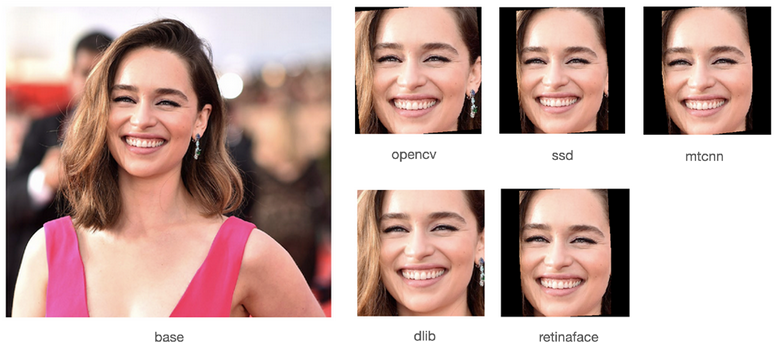
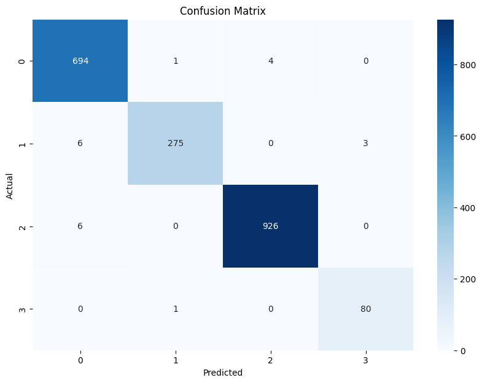

# Facial Music Emotion Recommendation System



---
## Business Part

**Emotion-DJ** is a groundbreaking app that enhances the music listening experience by recommending Spotify songs based on the user's current emotional state, detected via facial recognition technology. This app targets tech-savvy young adults who value personalized digital experiences. By automating emotion detection, Emotion-DJ offers a seamless and unique service that differentiates it from traditional music recommendation platforms which require manual mood input.

The core technology behind Emotion-DJ uses advanced AI to analyze facial expressions from user-uploaded images to identify emotions like happiness, sadness, or anger. This emotional data triggers a customized playlist from Spotify, matching the user's mood with appropriate songs. The app is designed to be intuitive, ensuring ease of use for photo uploads and music browsing.

## Technicities

### Computer Vision Task - Facial Emotion Recognition
__Data Preparation__

Dataset Download:
The dataset used for this project was downloaded from Kaggle, which contains images categorized by different emotions such as 'angry', 'happy', 'sad', etc. The dataset was extracted and stored in designated directories for training and testing.

Creating DataFrames:
A function was created to iterate through the image directories, collect image file paths and their corresponding labels, and store this information in Pandas DataFrames for both the training and testing datasets.

Feature Extraction:
Another function was developed to read and process the images. This function loads the images in grayscale, converts them to NumPy arrays, reshapes them to the required input shape for the model, and stores them in a list.

Normalization:
The pixel values of the images were normalized by dividing each pixel value by 255.0. This ensures that the input features are on a similar scale, which helps in improving the model's performance.

Label Encoding:
The emotion labels were encoded into numerical values using LabelEncoder, and then converted into categorical format using to_categorical from Keras.

__Neural Network Structure & Results__

Model Architecture:

The model was built using the Keras Sequential API. It consists of several convolutional layers followed by max-pooling and dropout layers. The number of filters increases progressively in the convolutional layers to capture hierarchical features.
After the convolutional layers, the model includes fully connected dense layers with dropout layers in between to prevent overfitting. The final layer is a softmax layer, which is suitable for multi-class classification.

Model Training:

The model was trained using the training dataset, with a batch size of 128 and for 100 epochs. The Adam optimizer was used, and the loss function was categorical cross-entropy.
During training, the model's performance was also evaluated on the validation (testing) dataset after each epoch.
Model Accuracy:
The training process took approximately 8 hours, resulting in an accuracy of 72%.

Model Saving:

The trained model's architecture and weights were saved to files (emotiondetector.json and emotiondetector.h5) for later use.


__Production Script__

Importing Required Libraries:

The script begins by importing the necessary libraries, including OpenCV for real-time computer vision tasks, and Keras for loading the pre-trained model.

FaceRecognition Class:

The FaceRecognition class is created to encapsulate the functionality of loading the model, detecting faces, and predicting emotions.
Class Initialization:

The __init__ method takes the file paths of the saved model architecture (json_file_path) and weights (weights_file_path).
The model architecture is loaded from the JSON file, and the weights are loaded from the H5 file. If the weights file does not exist, a FileNotFoundError is raised.
A pre-trained face detection model (haarcascade_frontalface_default.xml) from OpenCV is loaded to detect faces in images.
Emotion class labels are defined as a dictionary, mapping numerical predictions to emotion names (e.g., 0: 'angry', 1: 'disgust', etc.).
Feature Extraction Method:

The extract_features method preprocesses the input image by normalizing the pixel values, expanding its dimensions to fit the model's expected input shape, and returns the processed image.
Emotion Recognition Method:

The recognize_emotion method takes a grayscale frame as input, detects faces within the frame using the loaded face cascade classifier, and initializes an empty list to store predictions.
For each detected face, the method extracts the region of interest (ROI), resizes it to 48x48 pixels (the input size expected by the model), and preprocesses it using the extract_features method.
The preprocessed face image is fed into the model to predict the emotion. The emotion with the highest probability is selected and added to the predictions list along with the face's bounding box coordinates.
The method returns a list of tuples containing the bounding box coordinates and the predicted emotion label for each detected face.


### MLP Classification Task - DNN Classifier to label Music Mood
_(Luca)_

__Neural Network Structure & Results__

The second part of this project was to build a classifer that can be used to classify music songs depending on their mood. To train our model we used a Kaggle Dataset that had already label over 3000 spotify songs using the audio components of each tracks.

_Here if we had more time we would have maybe train a neural network to this labelling work in a "unsupervised way" using auto-encoders?_

Our neural network as the following structure 5 - 64 -32 -4, using relu activation function within the 2 hidden layer and a softmax activation function in the output layer. We use an Adam optimizer with sparse-cross-entropy loss function looking for accuracy. We did a 80/20 split and trained the network over 50 epochs, resulting on an accury on test of 98,947%, with the followinf confusion matrix:




__Production Script__

_Saving the model components_

In order to put our train model into production for our final application we had to perform several tasks.
First we saved the initial trained model using keras `model.save` method and then in order to lighter the model for production purposes we parsed it using `TFLiteConverter`[green] method. We then also used joblib to load the label encoder + our scaler of our input audio features.

_Production Scripts_

On this part the directory contains the previous mentioned model components, a utils.py (used for initial trained model) and utils2.py (= used with the lighter model) and the key scripts:

- music_emotion_classifier.py

- music_emotion_classifier_app_version.py _(that was then moved to main folder to solve package dependency issues)_

In practice, the following scripts does this following workflow:

`playlist_track_classifier`: 

By passing a spotify playlist idea this function uses the `fetch_playlist_songs`from utils.py/ utils2.py to fetch the different spotify track ids with a limit of 20 per call. - _Here note, that we can fine tune this to avoid an API call 425 errors of the spotify api._

Then we iterate over each track id on the utils.py/utils2.py `get_songs_features` method to fetch the audio features that will be serve as an input in our model to predict the mood of each tracks with the utils.py/utils2.py `predict_track_mood`method.

`converter`:

This function takes as parameters the output of the computer vision model and a spotify playlist id (by default one is already set). It then by using the previous mentioned function `playlist_track_classifier` do the inference and map the the output of the cv model to the 4 different track mood as follows:

```python
label_dict = {
    2: ['happy', 'surprised'],  # "Happy",
    3: ['sad', 'disgusted'],    # "Sad",
    0: ['neutral'],             # "Calm",
    1: ['angry', 'fearful']     # "Energetic"
}
```
_Here note that we could revise the way we map the different outputs_

The converer also retrieve the meta_data of the track such as the id, name, artist, album and preview_url (which will be used with streamlit st.audio component for user experience).

For the `main.py`script only the `converter` function is used.

### How-to

easy-way: [emotion-dj-app](https://emotion-dj.streamlit.app/)

1) First git clone the repo

2) Set your Spotify API credentials: client id + client secret

3) Run ```streamlit run main.py``` on your terminal.


